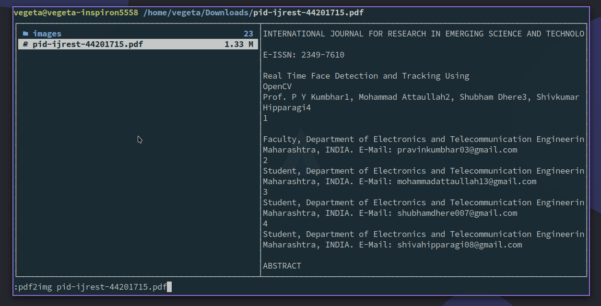

# pdf2img

## Introduction

Convert pdf to images.

## Requires

- pdf2image
- python3

```shell
pip install pdf2image
```

## Show



## Install

```shell
git clone https://github.com/demonlord1997/pdf2img
```

( If you only use it in [ranger](https://github.com/ranger/ranger), you need not to install it. )

## Usage
### Use In Shell

| Parameters         | Description                                |
|:-------------------|:-------------------------------------------|
| `--inputfile`/`-i` | PDF file                                   |
| `--dpi`/`-d`       | Resolution of images, default value is 600 |
| `--outfolder`/`-f` | Path of outputing images                   |
| `--outfile`/`-o`   | image's name                               |

For example:
```shell
python pdf2img.py -i example.pdf -d 600 -f . -o example

```

### Use In Ranger

If you want to use pdf2img in ranger, you need not to clone the repository. I have prepared the class named `pdf2img` for you:
```python
class pdf2img(Command):
    """
    :pdf2img <fname>

    Convert PDF-file to image
    """
    def execute(self):
        import tempfile
        from pdf2image import convert_from_path,convert_from_bytes

        if not self.arg(1):
            pdf_file = self.fm.thisfile.path
        else:
            pdf_file = self.rest(1)

        output = pdf_file[0:-4]
        with tempfile.TemporaryDirectory() as path:
            image_from_path = convert_from_path(pdf_file, dpi=400, fmt='png', output_folder='.', output_file=output)

    def tab(self, tabnum):
        return self._tab_directory_content()
```
You can copy the class into `commands.py` of ranger. (~/.config/ranger/commands.py)

Then you can input `:pdf2img <PDF-file>` in ranger.


